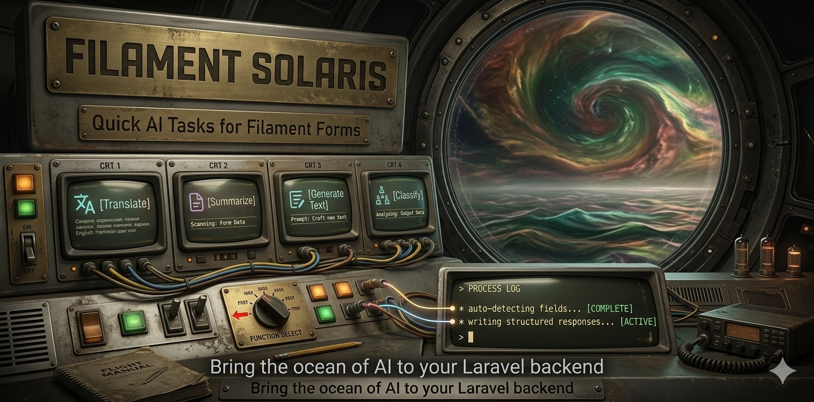
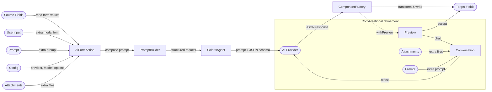
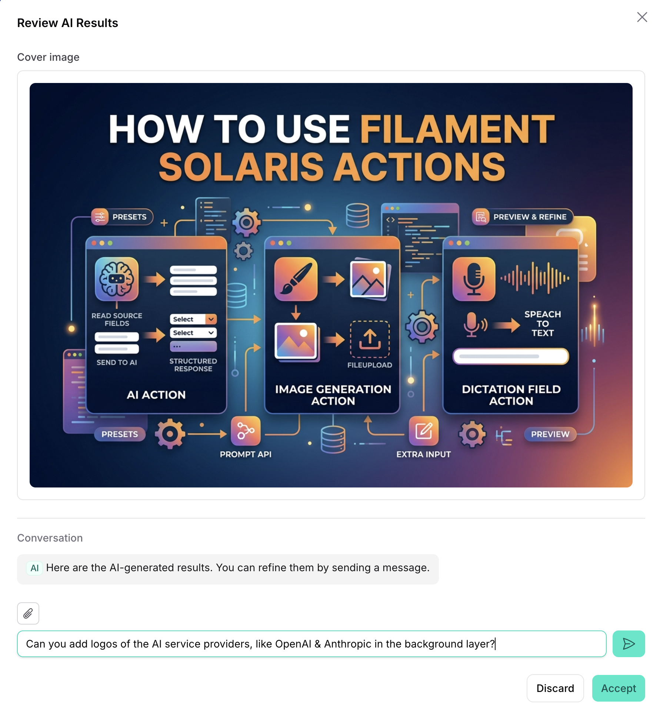
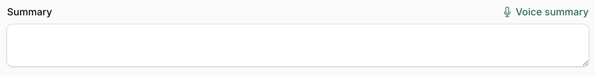
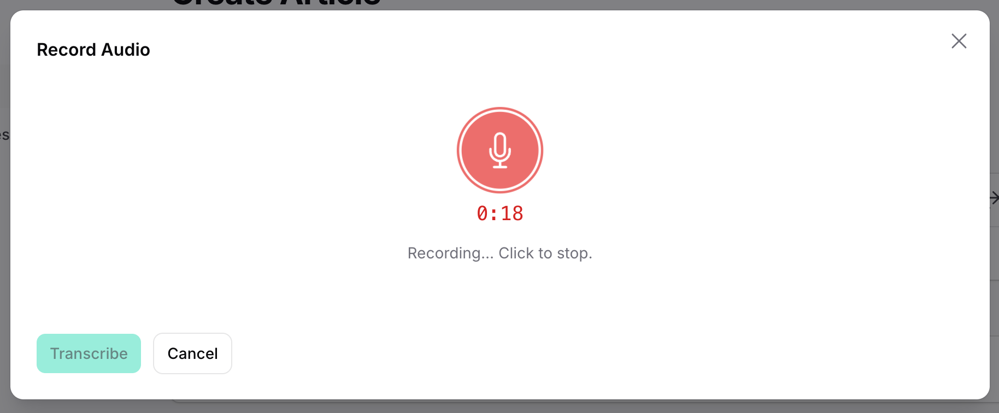
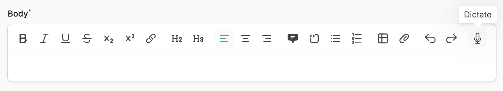
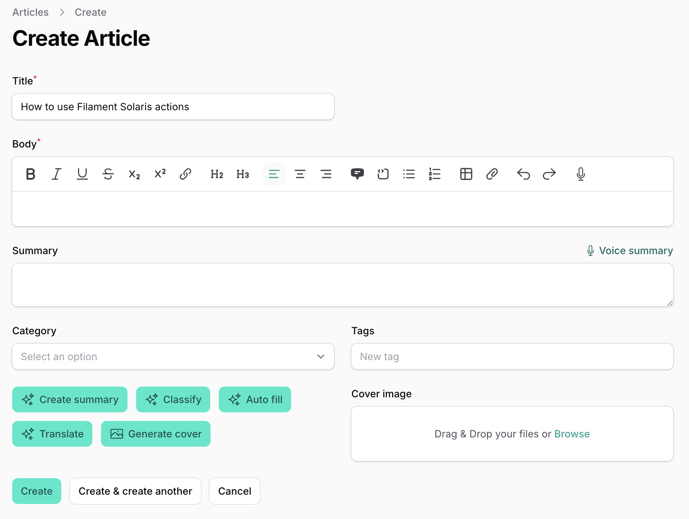

# Laravel Filament Solaris

[](https://packagist.org/packages/statikbe/laravel-filament-solaris)
[](https://github.com/statikbe/laravel-filament-solaris/actions?query=workflow%3Arun-tests+branch%3Amain)
[](https://github.com/statikbe/laravel-filament-solaris/actions?query=workflow%3A"Fix+PHP+code+style+issues"+branch%3Amain)
[](https://packagist.org/packages/statikbe/laravel-filament-solaris)

AI actions for Filament v4 & v5 — drop a button on any form to summarize, classify, translate, generate, transcribe, or create images, with the result written straight back into your fields. Powered by [laravel/ai](https://github.com/laravel/ai).

> “There are no answers, only choices.” ― Stanisław Lem, Solaris

## What you get

- **`AiFormAction`** — read source fields, send them to an AI provider, write a structured response back into one or more target fields. Filament component types are auto-detected (Select, Toggle, RichEditor, …) and the AI is constrained to a matching JSON schema, so a `Select` only ever gets a valid option.
- **`AiGenerateAction`** — generate structured data against a schema you control (custom or model-derived) and handle it yourself (seed records, build a taxonomy, gather info) — no form required.
- **`ImageGenerationAction`** — generate (or edit/reskin) images and store them straight into a `FileUpload` / Spatie media field.
- **`DictationFieldAction`** — record audio, transcribe it, and drop the text into a field — optionally piped through the AI pipeline first. A **`RichEditor` toolbar button** variant inserts the transcript at the cursor.
- **Presets** for the common jobs (summary, classification, translation, generation) and a prompt API (inline string, Blade view, or custom builder) for everything else.
- **Extra input modal and attachments** to add extra user input to the prompt.
- **Preview & conversational refinement** — let users review and chat-refine the result before it touches the form.
- **Production-minded** — per-action/preset/panel provider config, usage-tracking events, rate-limit handling, a security model for AI output, and full test fakes.

## Table of Contents

- [How It Works](#how-it-works)
- [Requirements](#requirements)
- [Installation](#installation)
- [Quick Start](#quick-start)
- [Recipes](#recipes)
- [Core Concepts](#core-concepts)
- [Security](#security)
- [Documentation](#documentation)
- [Versioning](#versioning)
- [License](#license)

## How It Works

`AiFormAction` is a Filament `Action` that reads values from source fields, sends them to an AI provider via `laravel/ai`, and writes structured responses back into target fields. The package auto-detects target component types (Select, TextInput, Toggle, etc.) and handles bidirectional data transformation — converting form state to prompt context and AI responses back to valid form state.



For the full execution-pipeline and class-hierarchy diagrams, see [Architecture](documentation/architecture.md).

## Requirements

- PHP `^8.3`
- Filament `^4.2 || ^5.0`
- [`laravel/ai`](https://github.com/laravel/ai) `^0.6` (configure at least one provider there first)
- Laravel `^12.0 || ^13.0`

## Installation

```bash
composer require statikbe/laravel-filament-solaris
```

Publish the config file:

```bash
php artisan vendor:publish --tag="filament-solaris-config"
```

Optionally publish the views (prompt templates) and translations:

```bash
php artisan vendor:publish --tag="filament-solaris-views"
php artisan vendor:publish --tag="filament-solaris-translations"
```

### Tailwind CSS (required)

Solaris ships Blade views (preview modal, conversational refinement modal, dictation modal, loading state, etc.) that use Tailwind utility classes. Without telling Tailwind to scan the package's views, those classes are purged and the modals render unstyled.

Add a `@source` directive to your [Filament theme CSS](https://filamentphp.com/docs/4.x/styling/overview):

```css
/* resources/css/filament/admin/theme.css */
@source "../../vendor/statikbe/laravel-filament-solaris/resources/views";
```

Then rebuild your Filament theme (`npm run build` or `php artisan filament:assets`). This is required for every consumer — not optional and not specific to any single action.

## Quick Start

The smallest useful `AiFormAction` reads one field, asks the AI to rewrite it, and writes the result straight back into the *same* field — a one-click "improve writing" button, no preset, no second field:

```php
use Statikbe\FilamentSolaris\Actions\AiFormAction;

Forms\Components\Actions::make([
    AiFormAction::make('improve-writing')
        ->sourceFields(['description'])
        ->targetField('description')
        ->prompt('Rewrite this text: fix grammar and spelling, tighten the phrasing, keep the meaning and tone.'),
]),
```

That's the whole loop: choose what to read, what to write, and how to instruct the AI. Here it's a one-line `->prompt()`; for the common jobs, [presets](#recipes) like `SummaryPreset`, `ClassificationPreset`, and `TranslationPreset` collapse the instruction into a tuned one-liner — and the AI is constrained to a schema that matches the target component, so a `Select` only ever receives a valid option. The next section has a recipe for each.

## Recipes

Self-contained snippets for the things you'll actually want to do. Each links to the full reference under [Documentation](#documentation).

### Summarize or rewrite text

```php
use Statikbe\FilamentSolaris\Prompts\Presets\SummaryPreset;

AiFormAction::make('summarize')
    ->sourceFields(['title', 'body'])
    ->targetField('summary')
    ->preset(SummaryPreset::make()->maxWords(100)->tone('professional'));
```

### Classify into a Select

The factory constrains the AI to the Select's actual options, so it can only return a valid key — even for relationship-backed selects.

```php
use Statikbe\FilamentSolaris\Prompts\Presets\ClassificationPreset;

AiFormAction::make('classify')
    ->sourceFields(['title', 'body'])
    ->targetField('category_id')
    ->targetScope('category_id', fn ($query) => $query->where('active', true))
    ->preset(ClassificationPreset::make()->context('tech blog'));
```

For Selects with hundreds of options the schema becomes free-text and the answer is matched back to a key — tunable, with a misclassification event. See [Option Matching](documentation/factories.md#option-matching).

### Translate a field

```php
use Statikbe\FilamentSolaris\Prompts\Presets\TranslationPreset;

AiFormAction::make('translate')
    ->sourceFields(['body'])
    ->targetField('body_nl')
    ->preset(TranslationPreset::make()->language('nl')->preserveFormatting());
```

### Fill several fields at once

One call writes a summary, picks a category, and extracts a set of tags — three different field types from a single response:

```php
AiFormAction::make('auto-fill')
    ->sourceFields(['title', 'body'])
    ->targetFields(['summary', 'category_id', 'tags'])
    ->prompt('Analyze the article. Summarize it, pick the best category, and suggest a few relevant tags.');
```

### Use a plain prompt (no preset)

For one-off jobs that don't warrant a preset, write the instruction inline — here, turning an article into a ready-to-post social blurb:

```php
AiFormAction::make('social-post')
    ->sourceFields(['title', 'body'])
    ->targetField('social_post')
    ->prompt('Write a short, upbeat social media post promoting this article. Max 280 characters, add 2-3 relevant hashtags.');
```

`->prompt()`, `->sourceFields()`, and `->targetFields()` also accept closures with Filament's dependency injection — reach for the current `$record` (and, in the prompt, the gathered `$sourceData`):

```php
AiFormAction::make('social-post')
    ->sourceFields(['title', 'body'])
    ->targetField('social_post')
    ->prompt(fn ($record) => "Write a social post promoting this article for a {$record->audience} audience.");
```

See [Closure Support](documentation/ai-form-action.md#closure-support) for the full injection list (`$record` is `null` on Create pages).

### Ask the user for guidance first

Open a modal before the AI runs and feed the answer into the prompt:

```php
use Statikbe\FilamentSolaris\Support\UserInput;

AiFormAction::make('generate')
    ->sourceFields(['title'])
    ->targetField('body')
    ->preset(GenerationPreset::make())
    ->userInput(
        UserInput::make()
            ->prompt('What should the AI write about?')
            ->placeholder('Describe the content you want...')
    );
```

Presets that ship their own default modal (e.g. `TranslationPreset`'s language picker) just need `->withDefaultUserInput()`. See [User Input](documentation/ai-form-action.md#user-input).

### Generate an image

```php
use Statikbe\FilamentSolaris\Actions\ImageGenerationAction;
use Statikbe\FilamentSolaris\Enums\ImageSize;

ImageGenerationAction::make('generate-cover')
    ->prompt('Generate a cover image for this article')
    ->sourceFields(['title', 'body'])
    ->targetField('cover_image')
    ->imageSize(ImageSize::Landscape)
    ->conversational();
```

Reference images (image-to-image / edits) and storage options are covered in [ImageGenerationAction](documentation/image-generation.md).

<div align="center">
  
</div>

The generated image lands in the preview modal, where the user can [refine it conversationally](#refine-conversationally) ("add logos of the AI providers in the background") before it's saved.

### Dictate into a field

Attach to any field via `->hintAction(...)` (or `->suffixAction(...)` on a TextInput). The transcript is written into the host field — no `->targetField()` needed.

```php
use Filament\Forms\Components\Textarea;
use Statikbe\FilamentSolaris\Actions\DictationFieldAction;

Textarea::make('notes')
    ->hintAction(
        DictationFieldAction::make()->lang('en')->append()
    );
```

Add a `->preset()` / `->prompt()` to pipe the transcript through the AI first (e.g. dictate rough notes → store a clean summary). See [Dictation](documentation/dictation.md).

<div align="center">
  
</div>

Clicking it opens a recording modal; on stop, the audio is transcribed and written into the field:

<div align="center">
  
</div>

It also works as a **RichEditor toolbar button** that inserts the transcript at the cursor — enable it per editor or globally (see [Dictation](documentation/dictation.md#toolbar-button-dictationricheditorplugin)):

```php
use Filament\Forms\Components\RichEditor;
use Statikbe\FilamentSolaris\RichEditor\DictationRichEditorPlugin;

RichEditor::make('body')->plugins([DictationRichEditorPlugin::make()]);
```

<div align="center">
  
</div>

### Seed records from AI

```php
use Statikbe\FilamentSolaris\Actions\AiGenerateAction;

AiGenerateAction::make('seed-categories')
    ->prompt('Generate realistic blog categories.')
    ->forModel(Category::class)
    ->count(20)
    ->handleUsing(fn (array $records) => Category::query()->insert($records));
```

Or define the shape yourself with `->outputSchema()` and do anything in the handler. See [AiGenerateAction](documentation/ai-generate-action.md).

### Preview before applying

Let the user review the result in a modal and accept or cancel:

```php
AiFormAction::make('summarize')
    ->sourceFields(['title', 'body'])
    ->targetField('summary')
    ->prompt('Summarise the body.')
    ->withPreview();
```

**Requires** the `InteractsWithSolarisPreview` trait on the Livewire component hosting the form (it fails loud if missing). Full setup in [Preview](documentation/ai-form-action.md#preview).

### Refine conversationally

Turn the preview into a chat so the user can iterate ("shorter", "more formal") before accepting:

```php
AiFormAction::make('summarize')
    ->sourceFields(['title', 'body'])
    ->targetField('summary')
    ->preset(SummaryPreset::make())
    ->conversational();  // implies ->withPreview()
```

Requires `laravel/ai`'s conversation migrations and an authenticated user — see [Conversational Refinement](documentation/ai-form-action.md#conversational-refinement).

### Track usage & cost

Every AI call dispatches an event. Listen for it to meter tokens, enforce budgets, or build an audit trail — Solaris persists nothing itself:

```php
use Statikbe\FilamentSolaris\Events\SolarisResponseReceived;

class TrackAiUsage
{
    public function handle(SolarisResponseReceived $event): void
    {
        AiCall::create([
            'action_name'     => $event->actionName,
            'user_id'         => $event->user?->getAuthIdentifier(),
            'model'           => $event->model,
            'prompt_tokens'   => $event->usage->promptTokens,
            'completion_tokens' => $event->usage->completionTokens,
            'duration_ms'     => $event->durationMs,
        ]);
    }
}
```

Full payload, the failure event, and rate-limit handling: [Usage Tracking](documentation/usage-tracking.md).

### Putting it together

A complete resource form combining several actions:

```php
use Filament\Forms;
use Statikbe\FilamentSolaris\Actions\AiFormAction;
use Statikbe\FilamentSolaris\Actions\DictationFieldAction;
use Statikbe\FilamentSolaris\Actions\ImageGenerationAction;
use Statikbe\FilamentSolaris\Enums\ImageSize;
use Statikbe\FilamentSolaris\Prompts\Presets\ClassificationPreset;
use Statikbe\FilamentSolaris\Prompts\Presets\GenerationPreset;
use Statikbe\FilamentSolaris\Prompts\Presets\SummaryPreset;
use Statikbe\FilamentSolaris\Prompts\Presets\TranslationPreset;

public function form(Form $form): Form
{
    return $form->schema([
        Forms\Components\TextInput::make('title')->required(),

        Forms\Components\RichEditor::make('body')->required(),

        Forms\Components\Textarea::make('summary')
            ->hintAction(
                // Voice-to-summary: transcribe audio, run through AI
                DictationFieldAction::make('voice-summary')
                    ->preset(SummaryPreset::make()->maxWords(100))
                    ->lang('en'),
            ),

        Forms\Components\Select::make('category_id')
            ->relationship('category', 'name'),

        Forms\Components\TagsInput::make('tags'),

        Forms\Components\Actions::make([
            AiFormAction::make('summarize')
                ->sourceFields(['title', 'body'])
                ->targetField('summary')
                ->preset(SummaryPreset::make()->maxWords(100)->tone('professional')),

            AiFormAction::make('classify')
                ->sourceFields(['title', 'body'])
                ->targetField('category_id')
                ->preset(ClassificationPreset::make())
                ->provider('openai', 'gpt-4o-mini'),   // cheaper model for a simple job

            AiFormAction::make('auto-fill')
                ->sourceFields(['title', 'body'])
                ->targetFields(['summary', 'category_id', 'tags'])
                ->prompt('Summarize, pick the best category, and suggest a few relevant tags.'),

            AiFormAction::make('translate')
                ->sourceFields(['body'])
                ->targetField('body_nl')
                ->preset(TranslationPreset::make()->language('nl')->preserveFormatting()),

            ImageGenerationAction::make('generate-cover')
                ->prompt('Generate a cover image for this article')
                ->sourceFields(['title', 'body'])
                ->targetField('cover_image')
                ->imageSize(ImageSize::Landscape),
        ]),

        Forms\Components\SpatieMediaLibraryFileUpload::make('cover_image')
            ->collection('cover')->disk('public')->image(),
    ]);
}
```

The form above, rendered with its Solaris action buttons, the "Voice summary" dictation hint, and the RichEditor dictate button:

<div align="center">
  
</div>

## Core Concepts

- **Component factories** translate between Filament components and AI — each one builds the JSON-schema fragment that constrains the AI's output and transforms the response back into valid form state. They're auto-resolved per target field, and you can register your own. Most form fields are supported (structural data fields like repeater and builder are future work). → [Component Factories](documentation/factories.md)
- **Presets** are reusable prompt builders for common jobs (`SummaryPreset`, `ClassificationPreset`, `TranslationPreset`, `GenerationPreset`). → [Presets Reference](documentation/presets.md)
- **Prompt builders** decide how a prompt is composed — inline string, Blade view, or a custom `PromptBuilder`. → [Prompt Builders](documentation/prompt-builders.md)
- **Configuration** spans package config, per-preset overrides, and per-panel plugin setters. → [Configuration](documentation/configuration.md)

## Security

Solaris connects two untrusted boundaries: user-typed values flow into the prompt, and AI-generated output flows back into form fields. Treat AI output as user-generated content — it's safe on the form itself (Blade escapes, Selects are enum-bounded), but **any place you render it as raw HTML** (`{!! !!}`, mail, PDF, CSV, webhooks) must be sanitized at render time. A per-action `->sanitize()` / `->sanitizeField()` hook is provided, and actions can be gated per-user or per-panel.

Read the full threat model and field-by-field guidance in [Security Considerations](documentation/security.md) before shipping a public-facing form.

## Documentation

| Topic | What's inside |
|---|---|
| [AiFormAction API](documentation/ai-form-action.md) | Source/target fields, prompts, user input, locale, provider, timeout, tools, generation options, attachments, preview, conversational refinement |
| [AiGenerateAction](documentation/ai-generate-action.md) | Custom/model-derived schema, custom handler, seeding |
| [Component Factories](documentation/factories.md) | Supported components, custom factories, option matching & fuzzy tuning |
| [Presets Reference](documentation/presets.md) | Summary / Classification / Translation / Generation + custom presets |
| [Prompt Builders](documentation/prompt-builders.md) | Inline, view, and custom prompt builders |
| [ImageGenerationAction](documentation/image-generation.md) | Sizes, quality, providers, storage, reference images |
| [Dictation](documentation/dictation.md) | Field action (transcription, AI chaining, providers) + RichEditor toolbar button (cursor insert) |
| [Usage Tracking](documentation/usage-tracking.md) | Events, metering, rate-limit handling & retry |
| [Security Considerations](documentation/security.md) | Threat model, render-layer guidance, sanitization hook |
| [Configuration](documentation/configuration.md) | All config keys + per-panel plugin |
| [Architecture](documentation/architecture.md) | Execution pipeline & class-hierarchy diagrams |
| [Testing](documentation/testing.md) | Fakes & assertions for all three actions |

## Versioning

Solaris ships as `0.x` while [`laravel/ai`](https://github.com/laravel/ai) is pre-1.0. The upstream SDK is itself `0.x` and doesn't promise SemVer guarantees, so every `laravel/ai` minor bump (`0.6` → `0.7`) is expected to require a Solaris release. Solaris will tag `1.0.0` once `laravel/ai` reaches `1.0` and its public surface settles.

While on `0.x`:

- **Minor** (`0.1` → `0.2`) — breaking changes are possible.
- **Patch** (`0.1.0` → `0.1.1`) — bugfixes, backwards-compatible additions.

Pin a minor in your `composer.json` if you want to avoid surprises:

```json
"statikbe/laravel-filament-solaris": "~0.1.0"
```

## Changelog

Please see [CHANGELOG](CHANGELOG.md) for more information on what has changed recently.

## Security Vulnerabilities

Please review [our security policy](../../security/policy) on how to report security vulnerabilities.

## Credits

- [Sten Govaerts](https://github.com/sten)
- [All Contributors](../../contributors)

## License

The MIT License (MIT). Please see [License File](LICENSE.md) for more information.
