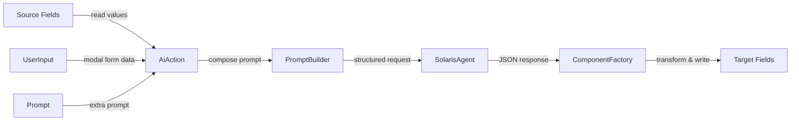
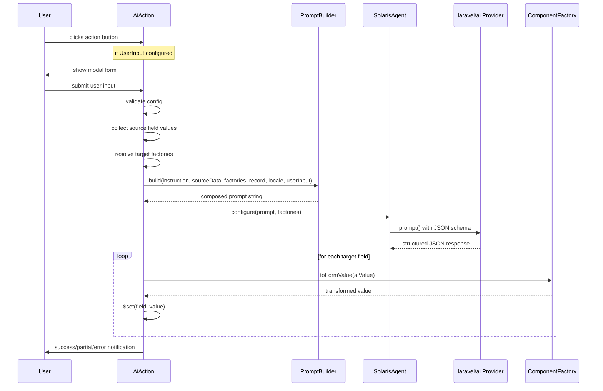
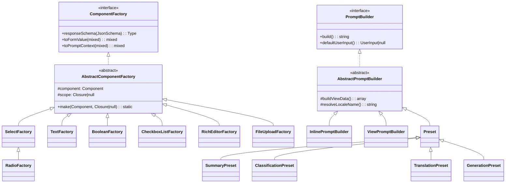

# Laravel Filament Solaris

[](https://packagist.org/packages/statikbe/laravel-filament-solaris)
[](https://github.com/statikbe/laravel-filament-solaris/actions?query=workflow%3Arun-tests+branch%3Amain)
[](https://github.com/statikbe/laravel-filament-solaris/actions?query=workflow%3A"Fix+PHP+code+style+issues"+branch%3Amain)
[](https://packagist.org/packages/statikbe/laravel-filament-solaris)

AI actions for Filament v4 & v5 — auto-detect form fields, compose prompts, write structured AI responses back, generate images, and transcribe audio. Powered by [laravel/ai](https://github.com/laravel/ai).

> “There are no answers, only choices.” ― Stanislav Lem, Solaris

## Table of Contents

- [How It Works](#how-it-works)
- [Requirements](#requirements)
- [Installation](#installation)
- [Quick Start](#quick-start)
- [Architecture](#architecture)
- [AiAction API](#aiaction-api)
  - [Source Fields](#source-fields)
  - [Target Fields](#target-fields)
  - [Prompts](#prompts)
  - [Presets](#presets)
  - [User Input](#user-input)
  - [Locale](#locale)
  - [Provider & Model](#provider--model)
  - [Timeout](#timeout)
  - [Tools](#tools)
  - [Generation Options](#generation-options)
  - [Preview](#preview)
- [Component Factories](#component-factories)
  - [Supported Components](#supported-components)
  - [Custom Factories](#custom-factories)
  - [Option Matching](#option-matching)
- [Presets Reference](#presets-reference)
  - [SummaryPreset](#summarypreset)
  - [ClassificationPreset](#classificationpreset)
  - [TranslationPreset](#translationpreset)
  - [GenerationPreset](#generationpreset)
  - [Custom Presets](#custom-presets)
- [Prompt Builders](#prompt-builders)
  - [Inline Prompts](#inline-prompts)
  - [View Prompts](#view-prompts)
  - [Custom Prompt Builders](#custom-prompt-builders)
- [ImageGenerationAction](#imagegenerationaction)
  - [Basic Usage](#basic-usage-1)
  - [Size & Quality](#size--quality)
  - [Provider & Model](#provider--model-1)
  - [Storage](#storage)
  - [Testing ImageGenerationAction](#testing-imagegenerationaction)
- [DictationAction](#dictationaction)
  - [Pure Transcription](#pure-transcription)
  - [Transcription + AI Processing](#transcription--ai-processing)
  - [Transcription Provider](#transcription-provider)
- [Testing](#testing)
- [Configuration](#configuration)
- [Changelog](#changelog)
- [License](#license)

## How It Works

`AiAction` is a Filament `Action` that reads values from source fields, sends them to an AI provider via `laravel/ai`, and writes structured responses back into target fields. The package auto-detects target component types (Select, TextInput, Toggle, etc.) and handles bidirectional data transformation — converting form state to prompt context and AI responses back to valid form state.



## Installation

```bash
composer require statikbe/laravel-filament-solaris
```

Publish the config file:

```bash
php artisan vendor:publish --tag="filament-solaris-config"
```

Optionally publish the views (prompt templates) and translations:

```bash
php artisan vendor:publish --tag="filament-solaris-views"
php artisan vendor:publish --tag="filament-solaris-translations"
```

## Quick Start

Add an `AiAction` to a Filament form. This example reads `title` and `body`, then writes a summary into the `summary` field:

```php
use Statikbe\FilamentSolaris\Actions\AiAction;
use Statikbe\FilamentSolaris\Prompts\Presets\SummaryPreset;

Forms\Components\Actions::make([
    AiAction::make('summarize')
        ->sourceFields(['title', 'body'])
        ->targetField('summary')
        ->preset(SummaryPreset::make()->maxWords(100)),
]),
```

Classify content into a Select field:

```php
use Statikbe\FilamentSolaris\Prompts\Presets\ClassificationPreset;

AiAction::make('classify')
    ->sourceFields(['title', 'body'])
    ->targetField('category_id')
    ->preset(ClassificationPreset::make()->context('tech blog'))
```

Use a plain prompt string:

```php
AiAction::make('generate-slug')
    ->sourceFields(['title'])
    ->targetField('slug')
    ->prompt('Generate a URL-friendly slug from the title. Lowercase, hyphens only, no special characters.')
```

## Architecture

### Execution Pipeline



### Component Hierarchy



## AiAction API

`AiAction` extends Filament's `Action` class and adds three concerns via traits: `HasSourceFields`, `HasTargetFields`, and `HasUserInput`.

### Source Fields

Source fields are the form fields whose values are read and sent to the AI as context.

```php
AiAction::make('summarize')
    ->sourceFields(['title', 'body', 'author'])
```

Use `sourceScope()` to transform a source value before it reaches the prompt. This is useful for truncating long content or formatting values:

```php
AiAction::make('summarize')
    ->sourceFields(['title', 'body'])
    ->sourceScope('body', fn (string $value) => str($value)->limit(3000)->toString())
```

### Target Fields

Target fields are the form fields that receive the AI response. The package auto-detects the Filament component type for each target field and instantiates the appropriate `ComponentFactory`.

```php
// Single target
AiAction::make('classify')
    ->targetField('category_id')

// Multiple targets
AiAction::make('fill')
    ->targetFields(['summary', 'category_id', 'is_featured'])
```

Use `targetScope()` to constrain relationship-based options (e.g., filter a Select's relationship query):

```php
AiAction::make('classify')
    ->targetField('category_id')
    ->targetScope('category_id', fn ($query) => $query->where('active', true))
```

### Prompts

There are three ways to provide a prompt:

**Inline string** — wrapped in the base prompt template with source data and JSON schema automatically appended:

```php
->prompt('Classify the content into the most appropriate category.')
```

**Blade view** — full control over the prompt template. Receives all standard variables (`$sourceData`, `$factories`, `$responseSchema`, `$record`, `$locale`, `$localeName`, `$userInput`):

```php
->prompt(view('prompts.my-custom-prompt'))
```

**Preset** — a pre-built prompt builder for common tasks:

```php
->preset(SummaryPreset::make()->maxWords(150)->tone('professional'))
```

### Presets

Presets are reusable prompt builders for common AI tasks. Each preset renders its own Blade template with configurable parameters. See [Presets Reference](#presets-reference) for the full API.

### User Input

User input opens a modal before the AI executes, allowing the end user to provide additional instructions or make selections. The user's input is included in the prompt.

```php
use Statikbe\FilamentSolaris\Support\UserInput;

AiAction::make('generate')
    ->sourceFields(['title'])
    ->targetField('body')
    ->preset(GenerationPreset::make())
    ->userInput(
        UserInput::make()
            ->prompt('What should the AI write about?')
            ->placeholder('Describe the content you want...')
    )
```

`UserInput` defaults to a single textarea with the name `user_instructions`. For custom form fields:

```php
->userInput(
    UserInput::make()->fields([
        Select::make('tone')
            ->options(['formal' => 'Formal', 'casual' => 'Casual'])
            ->required(),
        TextInput::make('keywords')
            ->placeholder('comma-separated keywords'),
    ])
)
```

Some presets define their own default user input (e.g., `GenerationPreset` adds a "What should the AI write?" textarea, `TranslationPreset` adds a language selector). Use `withDefaultUserInput()` to enable it:

```php
AiAction::make('translate')
    ->sourceFields(['body'])
    ->targetField('body_nl')
    ->preset(TranslationPreset::make()->language('nl'))
    ->withDefaultUserInput()
```

### Locale

By default the application locale (`app()->getLocale()`) is used as a hint in the prompt. Override per-action:

```php
->locale('nl')
```

### Provider & Model

Override which AI provider and model are used per-action. When not set, the package falls through a resolution chain: action → preset → config `preset_providers` → config `default_provider` → `laravel/ai` default. See [Configuration](documentation/configuration.md) for details.

```php
// Single provider + model
AiAction::make('summarize')
    ->provider('anthropic', 'claude-sonnet-4-5-20250514')

// Failover array — tries providers in order on failure
AiAction::make('summarize')
    ->provider(['openai' => 'gpt-4o', 'anthropic'])

// Closure (Filament convention)
AiAction::make('classify')
    ->provider(fn () => config('my-app.ai_provider'))

// On a preset
->preset(SummaryPreset::make()->provider('openai', 'gpt-4o-mini'))
```

### Timeout

Set the HTTP timeout in seconds for the AI call. Defaults to the `laravel/ai` default (60s) when not configured.

```php
AiAction::make('summarize')
    ->timeout(120)  // 2 minutes for long content

AiAction::make('classify')
    ->timeout(30)   // quick classification
```

A package-wide default can be set in the config (`default_timeout`). See [Configuration](documentation/configuration.md).

### Tools

Pass tools to the underlying `laravel/ai` agent for this action. Tools are provider-specific — refer to your provider's laravel/ai documentation for available tool classes.

```php
use OpenAI\Laravel\Facades\OpenAI;

AiAction::make('research')
    ->sourceFields(['query'])
    ->targetField('result')
    ->tools([new WebSearchTool()])

// Closure form
AiAction::make('research')
    ->tools(fn () => auth()->user()->can('web-search') ? [new WebSearchTool()] : [])
```

### Generation Options

Tune the underlying text generation. All four options are optional — when not set, `laravel/ai` falls back to the agent's PHP attributes (`#[Temperature]`, `#[MaxTokens]`, `#[MaxSteps]`, `#[TopP]`) and then to the provider's own defaults.

```php
AiAction::make('summarize')
    ->temperature(0.7)   // sampling temperature (float)
    ->maxTokens(2048)    // hard cap on output tokens
    ->maxSteps(5)        // max tool-call steps in an agent loop
    ->topP(0.95)         // nucleus sampling
```

Setters accept `Closure` for runtime values (user preferences, feature flags, per-record tuning):

```php
AiAction::make('summarize')
    ->temperature(fn () => auth()->user()->ai_creativity)
    ->maxTokens(fn () => $this->record->is_premium ? 4096 : 1024)
```

On a preset:

```php
->preset(SummaryPreset::make()->temperature(0.3)->maxTokens(512))
```

Resolution chain per option (highest wins): action → preset → config `preset_providers[class]` → config `default_*` → `laravel/ai` default. See [Configuration](documentation/configuration.md) for the package-wide `default_temperature` / `default_max_tokens` / `default_max_steps` / `default_top_p` keys.

### Closure Support

Most setters accept a `Closure` alongside their static type, following Filament's own pattern. The closure is resolved at execution time via Laravel's `value()` helper, enabling dynamic configuration based on the current record or application state:

```php
AiAction::make('translate')
    ->sourceFields(fn () => ['title', "body_{$sourceLocale}"])
    ->targetFields(fn () => ["body_{$targetLocale}"])
    ->locale(fn () => auth()->user()->locale)
    ->preset(
        TranslationPreset::make()
            ->language(fn () => $this->record->target_language)
    )
```

Closures are supported on: `sourceFields()`, `targetFields()`, `locale()`, `provider()`, `timeout()`, `tools()`, `temperature()`, `maxTokens()`, `maxSteps()`, `topP()`, `userInput()`, and all preset setters (e.g., `maxWords()`, `tone()`, `language()`, `style()`, etc.). Static values continue to work unchanged.

### Preview

Enable a preview modal that shows the AI result before applying it to the form:

```php
->withPreview()
```

## Component Factories

Factories are the bridge between Filament components and AI. Each factory implements three methods:

| Method | Purpose |
|---|---|
| `responseSchema(JsonSchema $schema): Type` | Returns the JSON schema fragment for this field, constraining the AI's output format |
| `toFormValue(mixed $aiValue): mixed` | Transforms the AI's raw JSON response into valid Filament form state |
| `toFormValueFromFile(string $content, string $mimeType): mixed` | Transforms generated file content (e.g. from `ImageGenerationAction`) into valid form state |
| `toPromptContext(mixed $formValue): mixed` | Transforms the current form state into a human-readable string for the prompt |

### Supported Components

| Filament Component | Factory | AI Schema | Notes |
|---|---|---|---|
| `Select` | `SelectFactory` | `string` enum or free-text | Enum mode for ≤100 options, free-text with fuzzy matching for >100 |
| `Radio` | `RadioFactory` | `string` enum or free-text | Extends `SelectFactory` |
| `ToggleButtons` | `SelectFactory` | `string` enum or free-text | Same as Select, supports `multiple()` |
| `CheckboxList` | `CheckboxListFactory` | `array` of `string` | Multi-select, same matching as Select |
| `TextInput` | `TextFactory` | `string` | Respects `maxLength` if set on the component |
| `Textarea` | `TextFactory` | `string` | Same as TextInput |
| `MarkdownEditor` | `MarkdownFactory` | `string` (Markdown) | AI prompted to output Markdown syntax |
| `RichEditor` | `RichEditorFactory` | `string` (HTML) | AI returns HTML, factory converts to TipTap JSON for form state |
| `CodeEditor` | `TextFactory` | `string` | Plain text |
| `Toggle` | `BooleanFactory` | `boolean` | Handles string/int coercion ("true", "yes", 1 → true) |
| `Checkbox` | `BooleanFactory` | `boolean` | Same as Toggle |
| `TagsInput` | `TagsFactory` | `array` of `string` | Includes suggestions in schema, handles comma-separated strings |
| `FileUpload` | `FileUploadFactory` | — | Supports `toFormValueFromFile()` for image generation output |
| `SpatieMediaLibraryFileUpload` | `FileUploadFactory` | — | Same as FileUpload — creates Livewire temp upload, Spatie handles Media record on save |

### Custom Factories

Register a factory for a custom or unsupported component:

```php
use Statikbe\FilamentSolaris\Facades\FilamentSolaris;

// In a service provider
FilamentSolaris::registerFactory(MyComponent::class, MyComponentFactory::class);
```

Or add it to the `factories` array in `config/filament-solaris.php`:

```php
'factories' => [
    // ...defaults...
    \App\Filament\Components\ColorPicker::class => \App\Factories\ColorFactory::class,
],
```

Implement the factory by extending the abstract base class:

```php
use Illuminate\JsonSchema\JsonSchemaTypeFactory;
use Illuminate\JsonSchema\Types\Type;
use Statikbe\FilamentSolaris\Factories\ComponentFactory;

class ColorFactory extends ComponentFactory
{
    public function responseSchema(JsonSchemaTypeFactory $schema): Type
    {
        return $schema->string()
            ->description('A hex color code, e.g. #ff5733')
            ->required();
    }

    public function toFormValue(mixed $aiValue): mixed
    {
        // Ensure the value starts with #
        return str_starts_with($aiValue, '#') ? $aiValue : "#{$aiValue}";
    }

    public function toPromptContext(mixed $formValue): mixed
    {
        return $formValue ?? 'No color selected';
    }
}
```

The factory map also supports class inheritance — if a factory is registered for a parent class, subclasses will match it automatically.

### Option Matching

`SelectFactory` and `CheckboxListFactory` use a 6-step fuzzy matching chain to resolve AI responses to valid option keys. This tolerates common AI "near-misses":

1. **Exact key match** — the AI returned the option key directly
2. **Exact label match** — the AI returned the option label
3. **Case-insensitive label** — "Technology" matches "technology"
4. **Substring** — "tech" matches "Technology & Science"
5. **Levenshtein ≤ 3** — "technolgy" matches "technology"
6. **Fallback** — return the raw value

When a Select/CheckboxList has more than `max_options` (default: 100) options, the schema switches from a strict enum to free-text with a sample of 10 options and relies on fuzzy matching to resolve the response.

## Presets Reference

### SummaryPreset

Generates a summary of the source content.

```php
SummaryPreset::make()
    ->maxWords(200)       // default: 200
    ->tone('professional') // default: config('filament-solaris.default_tone')
    ->language('French')   // overrides locale for output language
```

### ClassificationPreset

Classifies content into the target field's options.

```php
ClassificationPreset::make()
    ->allowMultiple()           // allow selecting multiple categories (for CheckboxList targets)
    ->context('tech blog')      // additional context about the classification domain
```

### TranslationPreset

Translates source content into a target language.

```php
TranslationPreset::make()
    ->language('fr')                // required — target language
    ->preserveFormatting()          // default: true — preserve HTML/Markdown structure
    ->glossary('API = API (never translate), Laravel = Laravel')
```

The `TranslationPreset` defines a `defaultUserInput()` that renders a language selector populated from `supported_locales`. Use `->withDefaultUserInput()` on the action to enable it.

### GenerationPreset

Generates new content based on source data and user instructions.

```php
GenerationPreset::make()
    ->tone('casual')
    ->style('blog post')
    ->audience('developers')
    ->maxLength(500)
```

Defines a `defaultUserInput()` with a "What would you like to generate?" textarea.

### Custom Presets

Extend the `Preset` base class to create reusable prompt patterns:

```php
use Statikbe\FilamentSolaris\Prompts\Presets\Preset;
use Statikbe\FilamentSolaris\Support\UserInput;

class SeoPreset extends Preset
{
    protected ?string $keyword = null;

    public function keyword(string $keyword): static
    {
        $this->keyword = $keyword;
        return $this;
    }

    protected function promptView(): string
    {
        // A Blade view in your application
        return 'prompts.seo';
    }

    protected function viewData(): array
    {
        return [
            'keyword' => $this->keyword,
        ];
    }

    // Optional: provide a default user input modal
    public function defaultUserInput(): ?UserInput
    {
        return UserInput::make()
            ->prompt('Target keyword')
            ->placeholder('Enter the primary SEO keyword');
    }
}
```

The Blade view receives all standard prompt variables (`$sourceData`, `$factories`, `$responseSchema`, `$record`, `$locale`, `$localeName`, `$userInput`) plus the preset's `viewData()`.

## Prompt Builders

The `PromptBuilder` interface has one method:

```php
public function build(
    string|View $instruction,
    array $sourceData,
    array $factories,
    ?Model $record = null,
    ?string $locale = null,
    array $userInput = [],
): string;
```

### Inline Prompts

Used when you call `->prompt('...')` with a string. Renders the `base-wrapper.blade.php` template which includes:
- A system preamble
- Your instruction
- User input section (if present)
- Locale hint (for non-English locales)
- Source data formatted as key-value pairs
- JSON response schema block

### View Prompts

Used when you call `->prompt(view('...'))`. The provided Blade view is rendered with all standard variables. You control the full prompt structure.

### Custom Prompt Builders

Implement `PromptBuilder` directly for full control:

```php
use Statikbe\FilamentSolaris\Contracts\PromptBuilder;

class MyPromptBuilder implements PromptBuilder
{
    public function build(
        string|View $instruction,
        array $sourceData,
        array $factories,
        ?Model $record = null,
        ?string $locale = null,
        array $userInput = [],
    ): string {
        // Build the prompt however you want
        return "...";
    }

    public function defaultUserInput(): ?UserInput
    {
        return null;
    }
}
```

Use it on an action:

```php
AiAction::make('custom')
    ->sourceFields(['title'])
    ->targetField('body')
    ->promptBuilder(new MyPromptBuilder())
```

## ImageGenerationAction

`ImageGenerationAction` generates images via `laravel/ai`'s Image API and writes them to `FileUpload` or `SpatieMediaLibraryFileUpload` fields. It composes a text prompt from an instruction, source field values, and optional user input.

### Basic Usage

```php
use Statikbe\FilamentSolaris\Actions\ImageGenerationAction;

Forms\Components\Actions::make([
    ImageGenerationAction::make('generate-poster')
        ->prompt('Generate a movie poster based on the story')
        ->sourceFields(['title', 'description'])
        ->targetField('poster'),
]),

SpatieMediaLibraryFileUpload::make('poster')
    ->collection('poster')
    ->disk('public')
    ->image(),
```

### Size & Quality

Control the image dimensions and quality using enums or strings:

```php
use Statikbe\FilamentSolaris\Enums\ImageSize;
use Statikbe\FilamentSolaris\Enums\ImageQuality;

ImageGenerationAction::make('generate')
    ->prompt('A hero banner image')
    ->targetField('hero_image')
    ->imageSize(ImageSize::Landscape)       // or 'landscape', '3:2'
    ->imageQuality(ImageQuality::High)      // or 'high'
```

Available sizes: `Square` (`1:1`), `Portrait` (`2:3`), `Landscape` (`3:2`) — or pass any ratio string directly.

Available qualities: `Low`, `Medium`, `High`.

### Provider & Model

Image generation has its own provider resolution chain, separate from the structured output pipeline:

```php
ImageGenerationAction::make('generate')
    ->prompt('A product photo')
    ->targetField('image')
    ->provider('openai', 'gpt-image-1.5')
    ->timeout(120)
```

**Resolution chain** (highest wins):
1. Action-level `->provider()`
2. Config `default_image_provider` / `default_image_model`
3. laravel/ai default (`config('ai.default_for_images')`)

Supported image providers in laravel/ai: **OpenAI**, **Gemini**, **xAI (Grok)**.

### Storage

For `FileUpload` and `SpatieMediaLibraryFileUpload` targets, the generated image is stored as a Livewire temporary upload. Filament's save pipeline handles the rest — including creating Spatie Media records. The image is stored to the disk/directory configured on the component itself.

For other component types (e.g. `TextInput`), the image is stored to the disk/directory from the package config and the path is set as the field value:

```php
// In config/filament-solaris.php
'default_image_disk' => null,           // null = default filesystem disk
'default_image_directory' => 'ai-images',
'default_image_visibility' => null,     // 'public' or null
```

### User Input

Add a modal for the user to provide additional instructions:

```php
use Statikbe\FilamentSolaris\Support\UserInput;

ImageGenerationAction::make('generate')
    ->prompt('Generate an image based on the product')
    ->sourceFields(['name', 'description'])
    ->targetField('image')
    ->userInput(UserInput::make()
        ->prompt('Any specific instructions?')
        ->placeholder('e.g. bright colors, minimalist style...')
    )
```

### Testing ImageGenerationAction

See [Testing documentation](documentation/testing.md#testing-imagegenerationaction).

## DictationAction

`DictationAction` captures audio via the browser's MediaRecorder API, transcribes it using `laravel/ai`'s Transcription API, and optionally processes the transcript through the AI pipeline. It works in two modes: pure transcription and transcription with AI processing.

### Pure Transcription

Records audio and writes the transcript directly to a text field. Use `suffixAction` on components that support it (TextInput, Select, TagsInput), or place the action in a `Forms\Components\Actions` group for Textarea/RichEditor:

```php
use Statikbe\FilamentSolaris\Actions\DictationAction;

// As a suffix action on TextInput
TextInput::make('title')
    ->suffixAction(
        DictationAction::make('dictate')
            ->targetField('title')
            ->lang('en-US')
    )

// For Textarea/RichEditor, use an Actions group
Forms\Components\Actions::make([
    DictationAction::make('dictate-notes')
        ->targetField('notes')
        ->lang('en-US')
        ->append(),     // append to existing content instead of replacing
]),
Textarea::make('notes'),
```

### Transcription + AI Processing

Records audio, transcribes it, then feeds the transcript into the AI pipeline as source data. The AI output is written to one or more target fields:

```php
DictationAction::make('voice-summary')
    ->targetFields(['summary', 'category_id'])
    ->preset(SummaryPreset::make()->maxWords(200))
    ->locale('nl')
    ->lang('nl-BE')
```

Works with any prompt or preset — the transcript becomes the source data (`['transcription' => $transcript]`).

### Transcription Provider

The transcription step and AI processing step can use different providers:

```php
DictationAction::make('voice')
    ->targetField('notes')
    ->preset(SummaryPreset::make())
    ->transcriptionProvider('openai', 'whisper-1')   // transcription
    ->transcriptionTimeout(30)                        // transcription timeout
    ->provider('anthropic', 'claude-sonnet-4-5-20250514')  // AI processing
    ->timeout(120)                                    // AI processing timeout
```

Package-wide defaults can be set in the config (`default_transcription_provider`, `default_transcription_model`, `default_transcription_timeout`). See [Configuration](documentation/configuration.md).

### How It Works

When the user clicks the dictation button, a modal opens with a recording UI. The user clicks to start recording, speaks, then clicks to stop. The audio is uploaded and transcribed server-side. In AI processing mode, the transcript is then fed into the prompt pipeline.

The recording UI shows clear visual states: a pulsing red button with elapsed timer while recording, a green checkmark when the upload completes, and inline error messages for microphone permission issues.

### Tailwind CSS

The modal view uses Tailwind classes. Add a `@source` directive to your Filament theme CSS so the classes are compiled:

```css
/* resources/css/filament/admin/theme.css */
@source "../../vendor/statikbe/laravel-filament-solaris/resources/views";
```

### Browser Support

DictationAction uses the MediaRecorder API and works in all modern browsers (Chrome 49+, Edge 79+, Firefox 25+, Safari 14.1+). The button is automatically hidden in unsupported browsers.

### Testing DictationAction

See [Testing documentation](documentation/testing.md#testing-dictationaction).

## Testing

If you want to write tests, please check [the testing documentation](documentation/testing.md).

## Configuration

The configuration is published to `config/filament-solaris.php`. Key options include:

- **AI provider & model** — package-wide defaults, per-preset overrides, failover arrays
- **Transcription provider** — separate provider/model/timeout for `DictationAction`
- **Image generation** — separate provider/model/timeout/size/quality/storage for `ImageGenerationAction`
- **Timeout** — default timeout for AI calls
- **Icons** — `action_icon` for AiAction, `dictation_icon` for DictationAction, `image_generation_icon` for ImageGenerationAction
- **Factory map** — custom component-to-factory mappings (includes `FileUploadFactory` for image targets)
- **Prompt logging** — log composed prompts and image generation calls during development
- **Locales** — supported locales for the translation preset

See the [Configuration Reference](documentation/configuration.md) for all available options.

## Full Example

A complete resource form with multiple AI actions:

```php
use Filament\Forms;
use Statikbe\FilamentSolaris\Actions\AiAction;
use Statikbe\FilamentSolaris\Actions\DictationAction;
use Statikbe\FilamentSolaris\Actions\ImageGenerationAction;
use Statikbe\FilamentSolaris\Enums\ImageSize;
use Statikbe\FilamentSolaris\Prompts\Presets\ClassificationPreset;
use Statikbe\FilamentSolaris\Prompts\Presets\GenerationPreset;
use Statikbe\FilamentSolaris\Prompts\Presets\SummaryPreset;
use Statikbe\FilamentSolaris\Prompts\Presets\TranslationPreset;
use Statikbe\FilamentSolaris\Support\UserInput;

public function form(Form $form): Form
{
    return $form->schema([
        Forms\Components\TextInput::make('title')
            ->required(),

        Forms\Components\RichEditor::make('body')
            ->required(),

        Forms\Components\Textarea::make('summary'),

        Forms\Components\Select::make('category_id')
            ->relationship('category', 'name'),

        Forms\Components\Toggle::make('is_featured'),

        Forms\Components\Actions::make([
            // Summarize the article
            AiAction::make('summarize')
                ->sourceFields(['title', 'body'])
                ->targetField('summary')
                ->preset(SummaryPreset::make()->maxWords(100)->tone('professional')),

            // Classify into a category (using a cheaper model)
            AiAction::make('classify')
                ->sourceFields(['title', 'body'])
                ->targetField('category_id')
                ->targetScope('category_id', fn ($q) => $q->where('active', true))
                ->preset(ClassificationPreset::make())
                ->provider('openai', 'gpt-4o-mini'),

            // Fill multiple fields at once
            AiAction::make('auto-fill')
                ->sourceFields(['title', 'body'])
                ->targetFields(['summary', 'category_id', 'is_featured'])
                ->prompt('Analyze the article. Summarize it, pick the best category, and decide if it should be featured.'),

            // Generate content with user guidance
            AiAction::make('generate')
                ->sourceFields(['title'])
                ->targetField('body')
                ->preset(GenerationPreset::make()->tone('casual')->audience('developers'))
                ->withDefaultUserInput(),

            // Translate into Dutch
            AiAction::make('translate')
                ->sourceFields(['body'])
                ->targetField('body_nl')
                ->preset(TranslationPreset::make()->language('nl')->preserveFormatting()),

            // Voice-to-summary: transcribe audio and run through AI
            DictationAction::make('voice-summary')
                ->targetField('summary')
                ->preset(SummaryPreset::make()->maxWords(100))
                ->lang('en-US'),

            // Generate a cover image from the article content
            ImageGenerationAction::make('generate-cover')
                ->prompt('Generate a cover image for this article')
                ->sourceFields(['title', 'body'])
                ->targetField('cover_image')
                ->imageSize(ImageSize::Landscape),
        ]),

        Forms\Components\SpatieMediaLibraryFileUpload::make('cover_image')
            ->collection('cover')
            ->disk('public')
            ->image(),
    ]);
}
```

## Changelog

Please see [CHANGELOG](CHANGELOG.md) for more information on what has changed recently.

## Contributing

Please see [CONTRIBUTING](CONTRIBUTING.md) for details.

## Security Vulnerabilities

Please review [our security policy](../../security/policy) on how to report security vulnerabilities.

## Credits

- [Sten Govaerts](https://github.com/sten)
- [All Contributors](../../contributors)

## License

The MIT License (MIT). Please see [License File](LICENSE.md) for more information.
