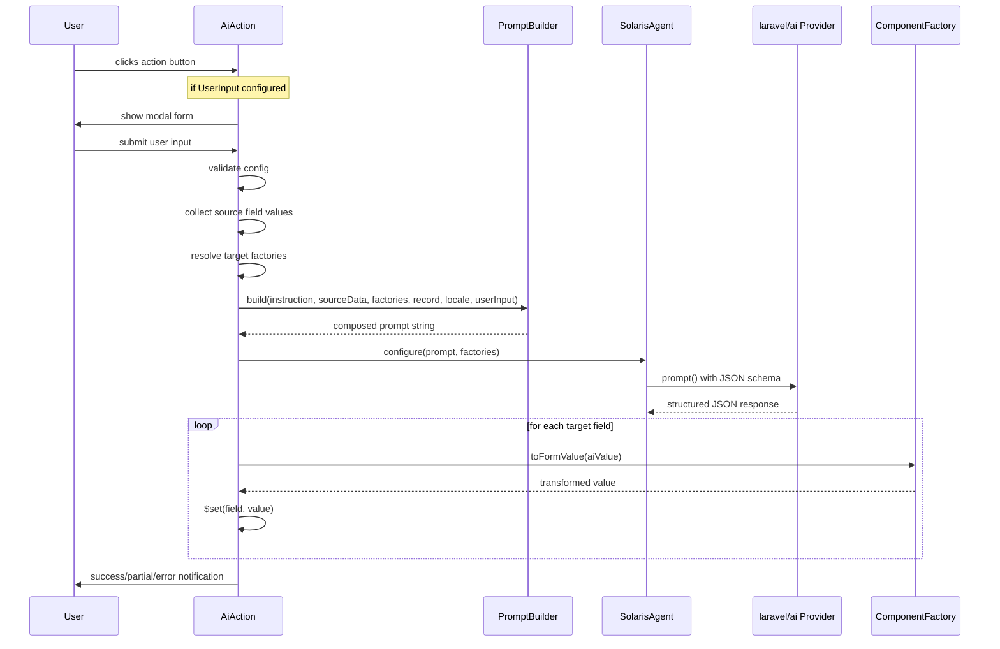
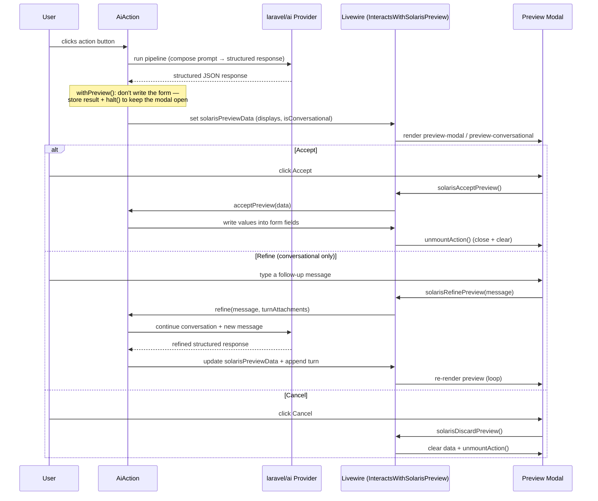
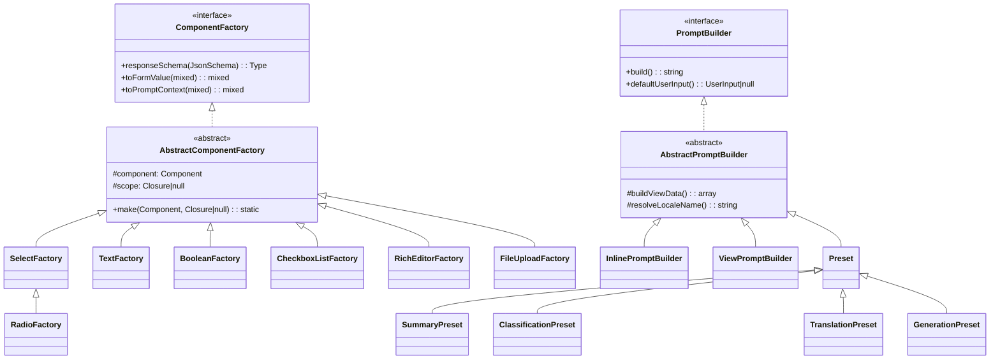

# Architecture

[← Back to README](../README.md)

## Execution Pipeline

This is the direct path. With `->withPreview()` the result isn't written immediately — it's parked for the user to review, per the next diagram.

## Preview & Conversational Refinement

When `->withPreview()` (or `->conversational()`, which implies it) is set, the pipeline runs the AI call but **defers the write**: the structured result is stored on the Livewire component's `solarisPreviewData` and the action `halt()`s so the modal stays open. The user then accepts, refines, or cancels. This requires the [`InteractsWithSolarisPreview`](ai-action.md#preview) trait on the host Livewire component, which provides the methods the modal dispatches to.

The refine loop re-runs the AI with the new message appended to the conversation (via `laravel/ai`'s `RemembersConversations`); each turn replaces the preview until the user accepts. See [Conversational Refinement](ai-action.md#conversational-refinement) for the requirements (migrations, authenticated user) and lifetime semantics.

## Component Hierarchy

