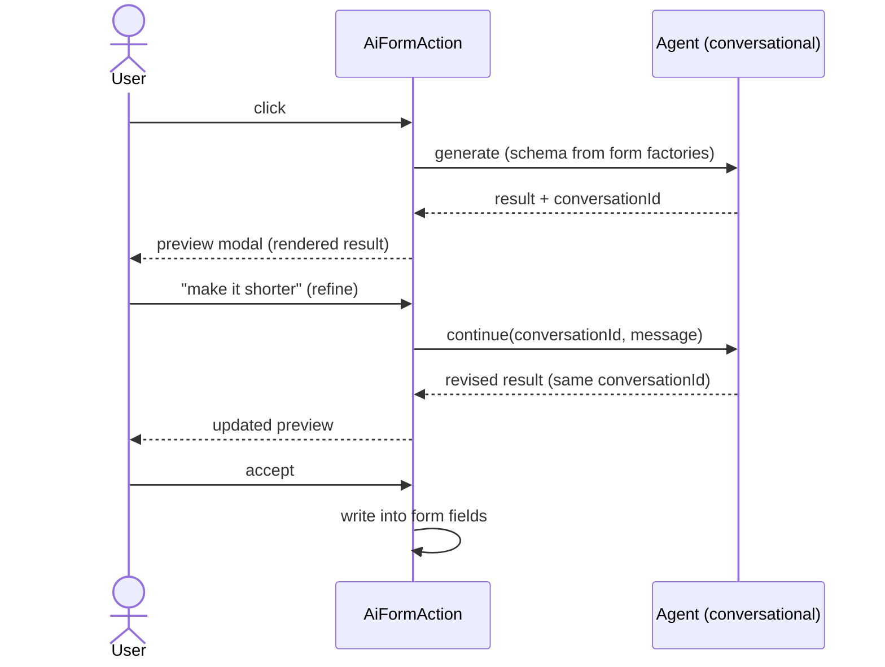
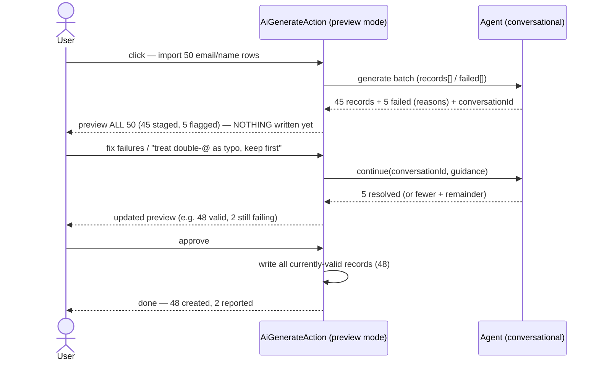
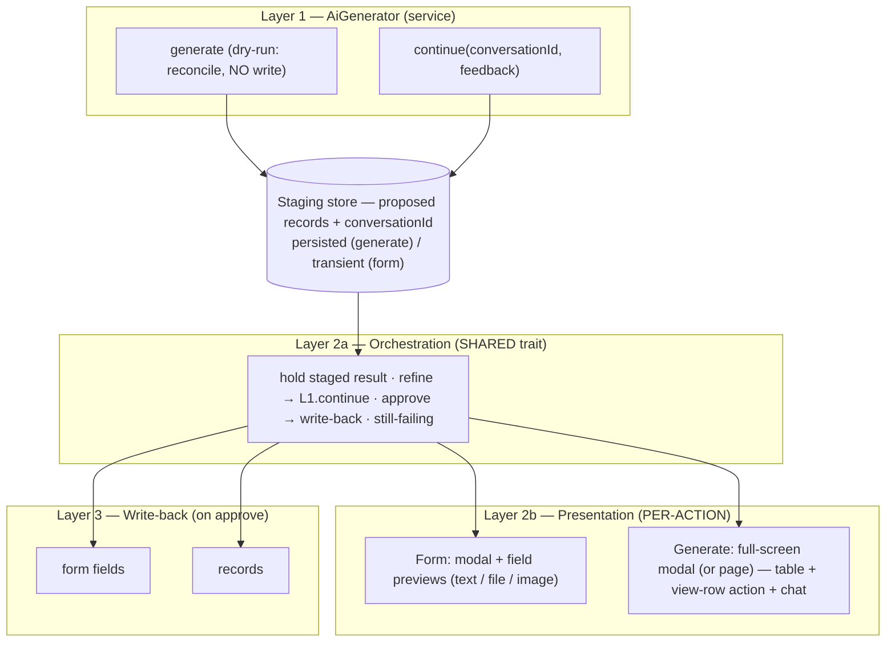
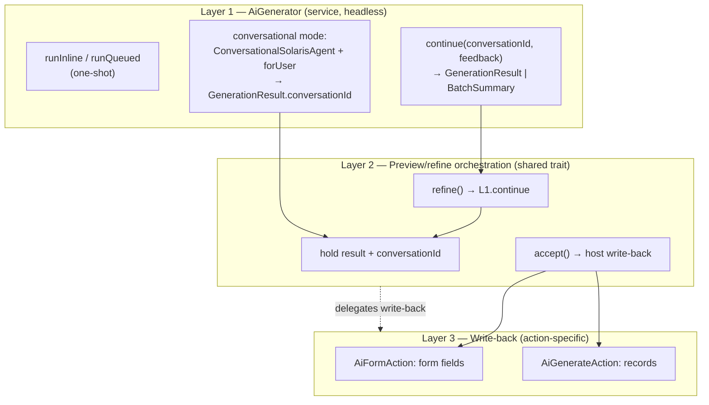
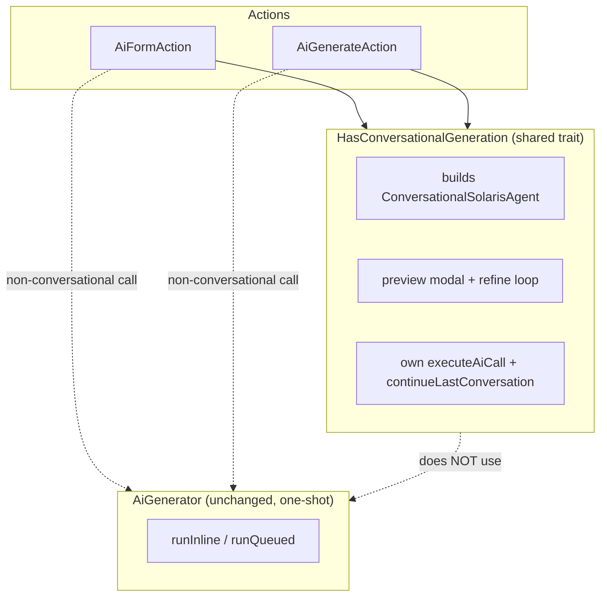
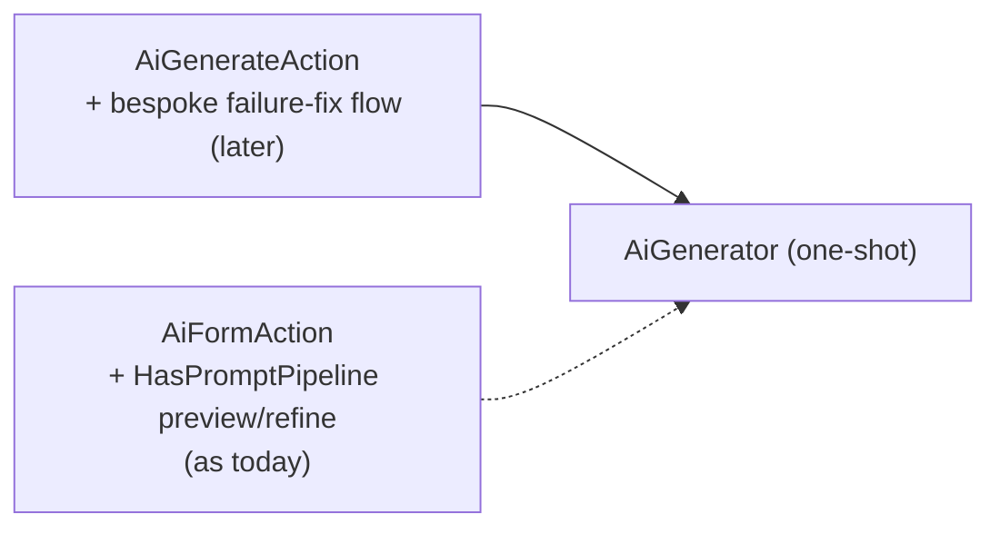
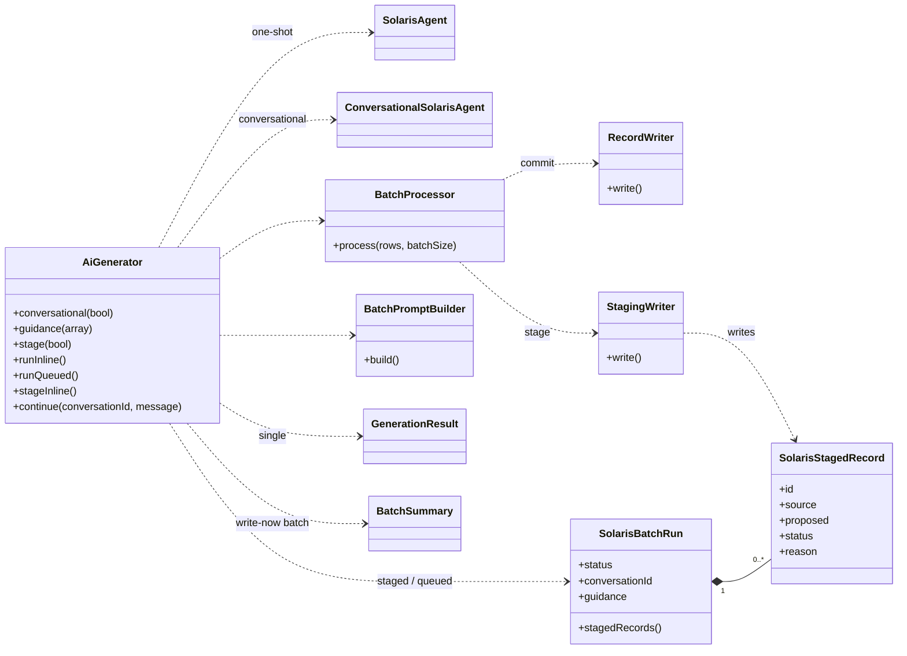
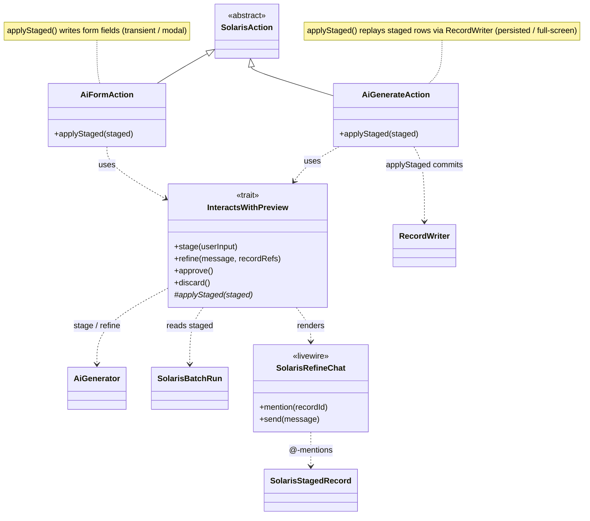

# 39 — Conversational + preview generation: architecture exploration

> **Status:** EXPLORATION — not a decided design. Comparing approaches before
> committing to a spec. Part of the AiGenerator arc (umbrella `36`); supersedes the
> naive "route AiFormAction through the service" framing once we account for
> conversational + preview as *shared* capabilities (form actions **and** generate
> actions).
> **Date:** 2026-06-29.

---

## Motivating cases for preview on a generate action

Two canonical Pattern-2 cases, both *stage → preview → refine → approve → write*:

1. **Validate/clean import** — a list of emails + names → create users. Source rows
   carry the data; the AI cleans it; failures = malformed data (double-`@`, bad
   chars). Review + fix the failures before any user is created.
2. **Enrichment** — a list of VAT numbers → create companies. Source rows carry only
   a *key*; the AI *fetches* the rest via **`tools()`** (search); failures =
   not-found / ambiguous. Preview is reviewing data fetched from the outside world,
   where a plausible-but-wrong match (right VAT format, wrong company) is the exact
   error you'd never catch without a review step.

Case 2 ties `tools()` (already on the service) + preview together — a strong
end-to-end validation target for the arc.

## The two interaction patterns

Conversational means different things for the two action types. Both share one
primitive — **generate → `conversationId` → feedback → continue → apply** — but
differ in the artifact, the UI, and the write-back.

### Pattern 1 — Form action: refine one artifact



### Pattern 2 — Generate action: stage, fix the failures, then commit

**Decision (2026-06-29):** nothing is written until the user approves. Generate →
**stage** the whole result (write nothing) → preview → refine the failures →
approve → write everything currently valid. This is safer (dry-run-then-commit)
*and* makes Pattern 2 structurally identical to Pattern 1 — the only differences
are the artifact shape and the write-back target.



**The shared primitive (what any architecture must provide):** a structured
generation that returns a `conversationId`, plus a `continue(conversationId,
feedback)` that yields the next structured result. `GenerationResult` already
carries `conversationId`; `ConversationalSolarisAgent` + `continueLastConversation`
already exist (used by `AiFormAction` today).

**What differs per action (stays action-specific):** the review UI (one artifact
vs. a failure table) and the write-back (form fields vs. records).

### Write timing: stage, then commit

Preview flips *when* write-back happens to **at approval**, so the service must
**separate "compute results" from "write results."** Today `BatchProcessor`
couples them — `persistRecord` fires *during* reconciliation. Preview needs:

```
reconcile → results (NO write) → [preview + refine loop] → write-on-approve
```

That "reconcile without writing" (a dry-run) is a clean separation worth having on
its own; it is exactly what makes preview possible.

- **Preview is opt-in.** The plain batch stays write-as-you-go (and a queued/huge
  batch can't be previewed interactively anyway). Preview mode is what flips
  write-timing — mirroring how `AiFormAction`'s preview is opt-in.
- **Still failing after refinement:** "approve" writes whatever is currently valid
  and reports the remainder. No infinite loop required.

---

## The preview surface: orchestration vs presentation

The preview/refine layer is **not** one shared thing — it splits into shared
*orchestration* and per-action *presentation*, plus a staging store that decouples
the two.



**Shared (Layer 2a):** the refine/approve state machine — identical for both.
**Per-action (Layer 2b):**
- *Form* — modal (must stay in form context), field-value previews (text / file /
  image). State held **transiently** (single artifact, ephemeral). ≈ today.
- *Generate* — a Filament table + view-row action + a chat panel. State **persisted**
  as a `Staged` `SolarisBatchRun` + proposed records.

**Modal vs page (generate):** persisting the staged records **decouples the shell
from the data** — a modal or a page just render the same staging record. So the
choice is reversible. Default to a **full-screen modal** (`MaxWidth::Screen`):
keeps Solaris's "just add an action" DX (no routing, no page registration, no
navigating away from the resource), and a viewport fits a table + chat. A
**dedicated page** stays available later for very large reviews with **zero
rework**, because the data already lives in the DB. Leading with a separate page is
resisted: it breaks the action-based integration model (ship/register a page +
route + redirect carrying state) to solve a problem a full-screen modal already
solves.

Persisted staging also pays for itself: pagination / sorting / a view action per
row, and surviving a mid-review refresh — all of which the table review wants
anyway, and all the natural output of the dry-run (reconcile-without-write) seam.
A shared **chat widget** (message list + input → refine) can be a Blade/Livewire
partial reused inside both shells.

## Today's reality

- `AiGenerator` (service): one-shot structured calls only, plain `SolarisAgent`.
  No conversation, no preview.
- `HasPromptPipeline` (AiFormAction, ~856 lines): builds `ConversationalSolarisAgent`,
  owns preview (`storePreviewData`), refinement (`runRefinement` →
  `continueLastConversation`), factory-derived schema, preset-aware resolution,
  `sanitize`. All bound to `AiFormAction`.

The conversational/preview machinery is **locked inside `AiFormAction`**. The
question is where it *should* live so a generate action can reuse it.

---

## Approach A — Conversational generation is a service capability

`AiGenerator` grows a first-class conversational mode; preview/refine UI is a thin
per-action layer that calls the service.



**Pros**
- True "one engine": one-shot *and* conversational are service capabilities;
  headless callers (knxcou, jobs) get conversation too.
- Both patterns reduce to "continue the conversation"; the failure-fix and
  artifact-refine flows share Layer 1 + Layer 2, differing only in UI + write-back.
- No re-duplication of the agent-build / call / events core we just centralised.

**Cons**
- `AiGenerator` gains conversational surface (`ConversationalSolarisAgent`,
  `continue`) — more than a pure stateless call engine.
- **Batch + conversation is novel design**: "continue a batch run to re-process
  failures" needs a contract (does `continue` take corrected rows? re-run only
  failures? thread the run id?). This is the genuinely new part.
- Biggest upfront design.

## Approach B — Shared conversational trait; service stays one-shot

A `HasConversationalGeneration` trait owns the modal + refine loop **and** builds
the conversational agent directly. Both actions use the trait. `AiGenerator`
stays a pure one-shot engine.



**Pros**
- Keeps `AiGenerator` small + headless; conversation lives in the action/Filament
  layer where the UI already is.
- Still reuses across both actions (one trait).

**Cons**
- Re-introduces the duplication we just removed: the trait rebuilds agent + call +
  events that the service owns — now in *two* call paths (service one-shot vs.
  trait conversational).
- Headless callers get **no** conversation (it's trait-only, action-only).
- "Two engines" for the conversational path.

## Approach C — Keep them separate (no forced unification)

`AiFormAction` keeps its preview/refine as-is. `AiGenerateAction` gets a
purpose-built failure-correction flow later, independently. No shared abstraction.



**Pros**
- Least coupling; each UX tailored; smallest blast radius now.
- Unblocks the cheap wins (parity ports, non-conversational AiFormAction routing)
  without touching conversation at all.

**Cons**
- Misses the reuse you flagged; conversational machinery likely built ~twice.
- The "three engines" smell returns for the conversational path specifically.

---

## Recommendation (for discussion)

**Approach A is the right north star** — conversational generation is a real
service capability, not a form concern, and your email-import example shows the
generate action wants it too. B saves nothing long-term (it rebuilds the core it
should reuse) and C bets against a future you've already said you want.

**But sequence it** — A's hard part is the *batch + conversation* contract, which
deserves its own design pass. So:

1. **Now (cheap, unblocks knxcou):** parity ports — `sanitize`/`sanitizeField`
   into the service write-back (+ `AiGenerateAction`), `preset` as a service prompt
   source. (`tools()` already on the service.) No conversation involved.
2. **Next:** route `AiFormAction`'s **non-conversational** call through
   `AiGenerator` (factory-schema support on the service) — kills the
   `HasPromptPipeline` one-shot duplication, leaves preview/refine where it is.
3. **Then (own arc):** lift conversational generation into the service (Layer 1) +
   extract the preview/refine loop into the shared Layer-2 trait, and design the
   batch-failure-continuation contract. This is where `AiGenerateAction` gains
   preview + conversational.

This gets knxcou unblocked immediately and reaches the "conversational on generate
actions" future without a big-bang refactor.

## Continuation: record-aware, not failed-only (decided 2026-06-29)

The conversation is a **general "talk about the staged result" tool, not a
failure-repair tool.** The preview shows **all** records (failures clearly
flagged); the user can refine **any** record, failed or not.

- **A turn can target specific records.** Mechanism: a **table row action that
  injects a reference to that record into the chat** (an @-mention) — preferred
  over asking the user to type IDs. So `continue()` is **record-aware**: it carries
  free-text guidance **plus** an optional set of referenced staged-record ids, and
  the AI sees those records' current staged values as context.
- Not subset-scoped: continuation may revise referenced records, the failures, or
  the whole staged set — driven by what the user references + says.
- A shared **chat widget** (message list + @-mention input → `continue`) is reused
  inside both shells.

## Staging store (open — to settle at spec time)
- A **dedicated staging table**, or a **JSON column** on an existing row (e.g. the
  `Staged` `SolarisBatchRun`). Both viable.

## Parked for a future session — form-action data + conversation + files
Persisting the **form action's** data *and its conversation* so that **files /
attachments survive across refine turns**. Collides with the known upstream gap
([[project_continue_conversation_todo]]): `continueLastConversation` does not
rehydrate attachments into rebuilt `Message` objects. Both the form and generate
flows need the conversation (and its attachments) to round-trip across turns; the
generate side persists a staging record anyway, but the *attachment rehydration*
problem is shared and unsolved. **Own session.**

## Run-scoped conversation + parallel execution (decided 2026-06-29)

The conversation is **one per run, NOT one per chunk/job** — so guidance is
coherent across the whole batch. But because queued chunks run **in parallel**, a
single *live* laravel/ai conversation thread can't be shared across jobs (linear
history → races; context window balloons → cost). Reconciliation — **separate the
run-level conversation/guidance from the parallel execution:**

- **Targeted/interactive refine** (user @-mentions a few records + guidance): a
  small, sequential, interactive call — may continue the run conversation directly.
- **Bulk re-process** ("re-run all failures with this guidance"): fans out to
  parallel chunks; each chunk **injects the accumulated run-level guidance into its
  prompt** (a distilled `## Guidance` block) rather than sharing a live thread.
  Every job still "knows what we discussed" — via injected guidance, not a raced
  thread.

The run-level conversation is a **persisted run entity** (tied to the staging
record / `SolarisBatchRun`): dialogue + accumulated guidance + `conversationId`.
Execution-level contrast: **form = one sequential conversation (continue the
thread); batch = one run-level guidance log injected into parallel (re)processing.**

Consequences:
- Batch path **sidesteps the parked attachment-rehydration gap** — it does not lean
  on `continueLastConversation` to carry context across chunks.
- **Anti-goal:** do NOT make parallel chunks share a single live LLM conversation.

## Matching `@row-id` to the conversation (decided 2026-06-29)

The join key is **the run, not the conversation** — they're siblings under one run.

- **`@row-id` is NOT the LLM `_index`.** `_index` is per-chunk + positional, so it
  repeats across a chunked/queued run (chunk 1 and chunk 2 both have `_index: 0`).
  The staging store must mint a **run-wide stable staged-record id** (auto-id /
  UUID) when it persists the staged result; the per-chunk `_index` is mapped to it.
  `@row-42` references *that* id.
- **No id-to-id matching with the conversation.** The run owns both the staged
  records and the run-level conversation/guidance log. Refine assembles the next
  call from: `@row-id → staging lookup (record's current data)` + accumulated
  guidance + the new message.
- **The run has a real conversation, reused for sequential refine** (corrected
  2026-07-02). Each run has one laravel/ai `conversationId`; the `@row-id` is
  **run-scoped** (composite `{runId}-{n}` or FK'd), so a row → its run → its
  conversation — self-describing, no lookup table. Sequential/interactive refine
  **continues that conversation** (`continueLastConversation`): one turn at a time,
  no concurrency, the AI remembers prior refine turns. The turn seeds a `## Records`
  block with the @-mentioned rows' current staged values. **Only parallel bulk
  re-processing** (fan-out over many failures) can't continue one linear thread —
  that case falls back to fresh calls injecting the conversation's distilled
  guidance.
- **Form** keeps the same model — a real `conversationId`, single sequential thread,
  no `## Records` block (the single artifact is already in the history).

**New must-have:** the staging store assigns a run-wide record id (do not reuse
`_index`).

### Where the refine prompt is built (revised 2026-07-02)

Both targeted refines **continue the run's conversation** (`continueLastConversation`);
they differ only in whether a `## Records` block is needed.

- **Batch refine (targeted / sequential)** — continue the run conversation; the new
  turn carries the user message + a `## Records` block seeding the @-mentioned rows'
  *current staged values* (keyed by the run-wide `@row-id`, the echo key). The AI
  remembers prior turns AND sees which rows + their state:
  ```
  (conversation history …)
  {user message: "treat double-@ as a typo, keep the first"}
  ## Records       ← @-mentioned rows' CURRENT proposed values, keyed by @row-id
  ## Instructions  ← echo @row-id unchanged, return corrected fields
  ```
  So `refine(message, refs)` → resolve `refs` to `SolarisStagedRecord.proposed` →
  continue the run conversation with the message + `## Records` block → AI returns
  updates keyed by `@row-id` → `StagingWriter` updates those staged rows → preview
  re-renders. `BatchPromptBuilder` assembles the `## Records` / `## Instructions`
  blocks (its one new responsibility).
- **Form refine** — single artifact already in the conversation history, so just
  append the user's message. No `## Records` block.
- **Bulk re-process (parallel fan-out only)** — the one case that can't continue a
  linear thread: fresh stateless calls per chunk, each injecting the conversation's
  distilled guidance. Exception, for scale.

Crux: **targeted refine (form or batch) continues the conversation (stateful) —
batch just seeds a `## Records` block for the referenced rows. Only parallel bulk
re-processing goes stateless.**

## Proposed class + trait structure (Approach A)

Two views. **NEW** = introduced by this arc; everything else exists today.

### View 1 — call engine + staging store



**Result & persistence types (deliberately minimal).** Return types: `GenerationResult`
(single call — *reused by the form preview, held transiently*), `BatchSummary`
(write-now batch aggregate), `SolarisBatchRun` (staged **or** queued handle;
`stageInline()` returns it, not a separate DTO). `StagedBatch` was dropped — a
staged batch *is* a `Staged` `SolarisBatchRun`. All three exist today. The **only**
genuinely-new persistence type is `SolarisStagedRecord` (the proposed rows) — and
that disappears if gap #2 lands on a JSON column instead of a table. The form flow
adds **zero** new data types.

- **NEW classes:** `StagingWriter`; `SolarisStagedRecord` (table option only).
- **NEW members:** `AiGenerator::{conversational, guidance, stage, stageInline,
  continue}`; `SolarisBatchRun::{Staged status, conversationId, guidance,
  stagedRecords()}`; `BatchPromptBuilder` guidance injection.
- **The dry-run seam** = swapping `BatchProcessor`'s persist callback:
  `RecordWriter` (commit → real model) vs `StagingWriter` (stage → staging store).
  `BatchProcessor` itself is unchanged. On **approve**, replay staged rows through
  `RecordWriter`.

### View 2 — actions + preview orchestration



- **NEW:** `InteractsWithPreview` (trait — generalises `InteractsWithSolarisPreview`),
  `SolarisRefineChat` (shared @-mention chat widget).
- **Layer 2a = the trait** (shared orchestration): `stage / refine / approve /
  discard`, plus the abstract `applyStaged()` each action implements (Layer 3
  write-back). **Layer 2b = presentation** stays per-action (form modal + field
  previews vs. generate full-screen table + chat) — deliberately *not* in the trait.

### Provisional calls baked into this diagram (each independently up for grabs)
1. `StagingWriter` as a persist-callback swap (vs. a `BatchProcessor` "reconcile
   only" mode). *Leaning swap — zero change to `BatchProcessor`.*
2. `SolarisStagedRecord` as a **new table** with a run-wide id (vs. a JSON column on
   the run). *Leaning table — the `@row-id` wants a real key + query/pagination.*
3. ~~`StagedBatch` DTO~~ — **resolved: dropped.** `stage*()` returns
   `SolarisBatchRun` (a `Staged` run); its `stagedRecords()` are the rows.
4. `continue()` serves the **form** (real laravel/ai conversation); **batch** refine
   = re-`stage()` with accumulated `guidance()` (no LLM continuation). *Reflects the
   run-scoped-conversation decision.*
5. Run conversation/guidance stored **on `SolarisBatchRun`** (`conversationId` +
   `guidance` json) vs. a separate message model. *Leaning on-the-run for now.*
6. One `InteractsWithPreview` trait for both actions, presentation left per-action.

## Still-open contract questions (Approach A, step 3)
- Does a continued batch reuse the same `SolarisBatchRun` (append) or open a new one?
- How accumulated guidance is distilled/stored on the run (raw messages vs. a
  condensed guidance block injected into chunk prompts).
- Attachment round-trip for the **form** sequential path (parked item).
